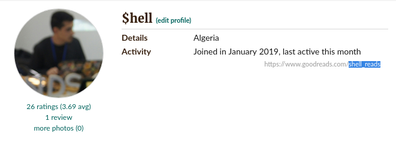

# Your bookshelf from the shell.

bookshell is an interactive python script that scrapes shelves/books from goodreads profiles using scrapy framework.

## Usage
### Installation

```
$ curl  https://shellmage.github.io/bookshell
$ chmod +x bookshell
$ bookshell
```

### CLI
```
$ ./bookshell.py 
Enter Goodreads username : shell_reads
You have 4 shelves, Which shelf do you want to examine ?
[0] read (27 books)
[1] currently-reading (2 books)
[2] to-read (122 books)
[3] my-collection (15 books)
Enter shelf number : 0
Vagabond, Vol. 1 ( By Inoue, Takehiko )  * * *  https://www.goodreads.com/book/show/251912.Vagabond_Vol_1
The Game of Life & How to Play ( By Shinn, Florence Scovel )  * * *  https://www.goodreads.com/book/show/15083819-the-game-of-life-how-to-play
The Catcher in the Rye ( By Salinger, J.D. )  * * *  https://www.goodreads.com/book/show/5107.The_Catcher_in_the_Rye
Berserk, Vol. 1 ( By Miura, Kentaro )  * * *  https://www.goodreads.com/book/show/248871.Berserk_Vol_1
No Boundary: Eastern and Western Approaches to Personal Growth ( By Wilber, Ken )  * * *  https://www.goodreads.com/book/show/449818.No_Boundary
Julius Caesar ( By Shakespeare, William )  * * *  https://www.goodreads.com/book/show/22178594-julius-caesar
1984 ( By Orwell, George )  * * *  https://www.goodreads.com/book/show/40961427-1984
قصص القرآن ( By المولى, محمد أحمد جاد )  * * *  https://www.goodreads.com/book/show/16083749
The Book Thief ( By Zusak, Markus )  * * *  https://www.goodreads.com/book/show/17857648-the-book-thief
L'étranger ( By Camus, Albert )  * * *  https://www.goodreads.com/book/show/2739351-l-tranger
Man's Search for Meaning ( By Frankl, Viktor E. )  * * *  https://www.goodreads.com/book/show/4069.Man_s_Search_for_Meaning
To Kill a Mockingbird ( By Lee, Harper )  * * *  https://www.goodreads.com/book/show/25587975-to-kill-a-mockingbird
12 Rules for Life: An Antidote to Chaos ( By Peterson, Jordan B. )  * * *  https://www.goodreads.com/book/show/37944583-12-rules-for-life
Oliver Twist ( By Rogers, Richard )  * * *  https://www.goodreads.com/book/show/2861725-oliver-twist
Le Petit Prince ( By Saint-Exupéry, Antoine de )  * * *  https://www.goodreads.com/book/show/18171850-le-petit-prince
Comment je suis devenu stupide ( By Page, Martin )  * * *  https://www.goodreads.com/book/show/442916.Comment_je_suis_devenu_stupide
Kafka on the Shore ( By Murakami, Haruki )  * * *  https://www.goodreads.com/book/show/6564051-kafka-on-the-shore
The Secret ( By Byrne, Rhonda )  * * *  https://www.goodreads.com/book/show/52529.The_Secret
أعط الصباح فرصة ( By مطاوع, عبد الوهاب )  * * *  https://www.goodreads.com/book/show/5880301
عشرة أمور تمنيت لو عرفتها قبل دخولي الجامعة ( By بكار, ياسر عبد الكريم )  * * *  https://www.goodreads.com/book/show/8574050
حديث الصباح ( By شرقاوي, أدهم )  * * *  https://www.goodreads.com/book/show/25009629
حديث المساء ( By شرقاوي, أدهم )  * * *  https://www.goodreads.com/book/show/29929174
The Subtle Art of Not Giving a F*ck: A Counterintuitive Approach to Living a Good Life ( By Manson, Mark )  * * *  https://www.goodreads.com/book/show/28257707-the-subtle-art-of-not-giving-a-f-ck
العبرات ( By المنفلوطي, مصطفى لطفي )  * * *  https://www.goodreads.com/book/show/3852939
قواعد العشق الأربعون: رواية عن جلال الدين الرومي ( By Shafak, Elif )  * * *  https://www.goodreads.com/book/show/16104434
ملائكة وشياطين ( By Brown, Dan )  * * *  https://www.goodreads.com/book/show/10501957
The Fault in Our Stars ( By Green, John )  * * *  https://www.goodreads.com/book/show/11870085-the-fault-in-our-stars
```

## Development

### depends
- python3
### Get project

```
$ git clone https://github.com/shellmage/bookshell.git
$ cd bookshell/
```

### requirements

```$ pip install scrapy pyinstaller```

### run

```$ ./bookshell.py```


#### Note

goodreads username is the string of text found at the end of the link on the profile page (highlighted on the screenshot)<br>
if there is no link on your profile, you can add it from your settings.<br>

